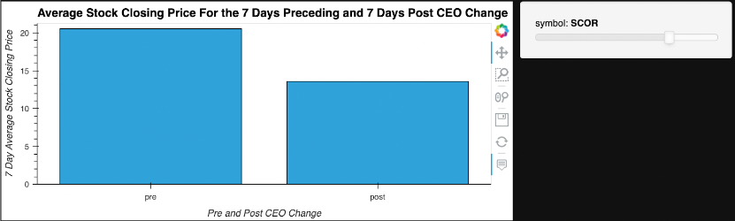
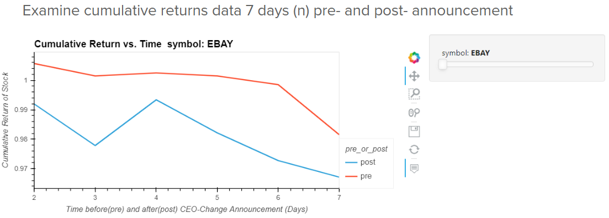
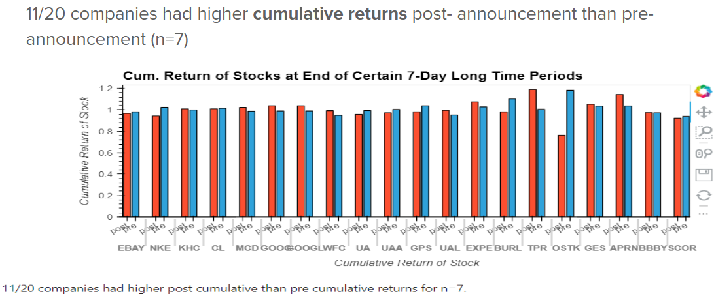
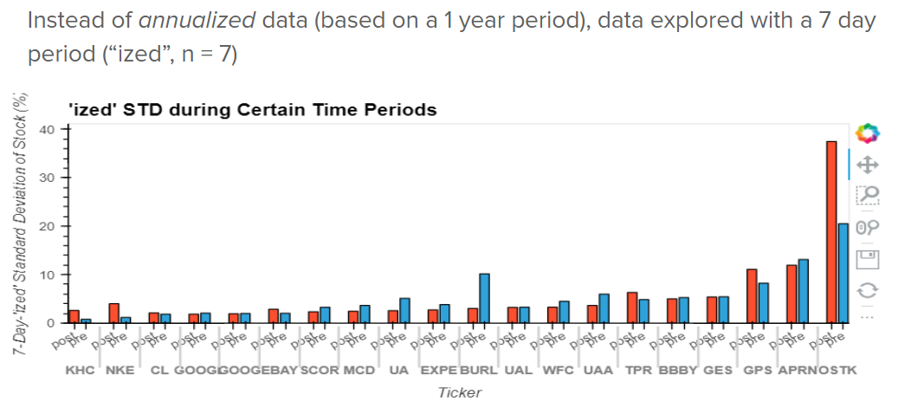
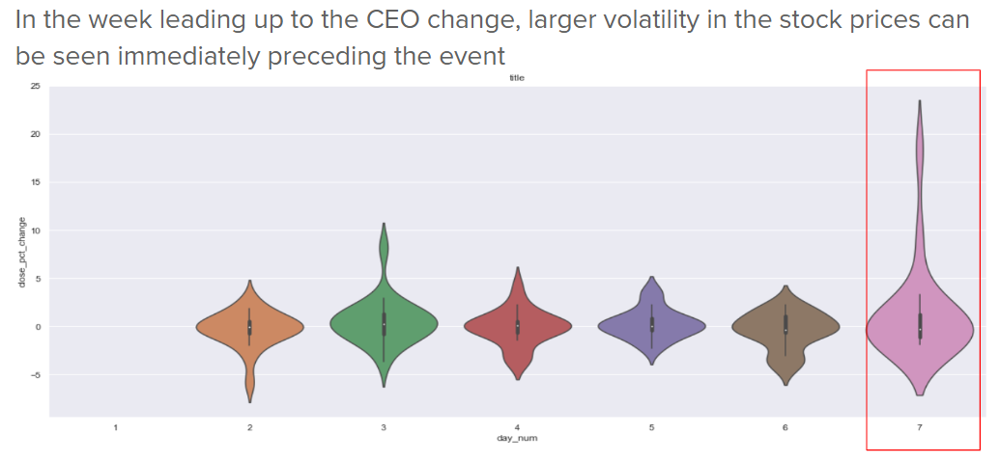
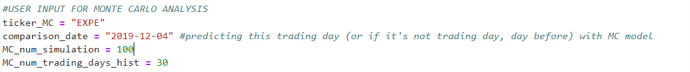
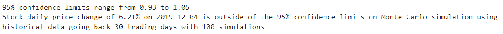
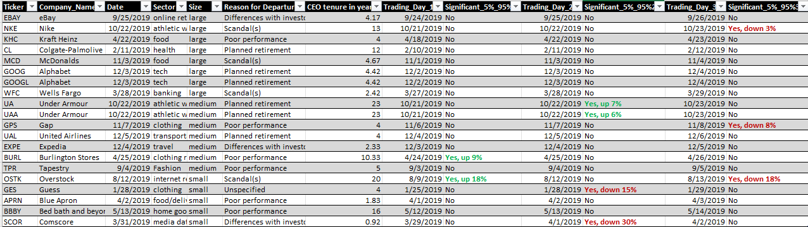

# Impact of CEO Change  
## Summary of Purpose  

This is an analysis of the effects a CEO change has on the stock-price of a company using Jupyter Notebooks.

We sought to find out the effects of a CEO change on companies of different sizes and from different sectors.  

To do this, we needed the data. We searched online and made a list of 20 companies with CEO changes in 2019. Then, we obtained 6 years worth of the stocks' data, centered around the date the CEO change was announced to the public. 

Next, we used this data to produce graphs & performance metrics like Sharpe ratios, rolling betas, etc. We then used these graphs & metrics to compare the performance of the stocks before & after the CEO change.

We also used Monte Carlo simulations to explore the data. We explored the trading days immediately before and after the CEO change to see if the announcement may have had a significant impact on the volalility of the stock. Using Monte Carlo models, we predicted 95% confidence limits around daily stock price fluctuations and used them to determine if the stock price change during the date of investigation fell outside or inside these limits. If the stock price change fell outside these limits, we can reasonably conclude that the announcement (or some other factor) had a significant impact on the stock price. 

We also analyzed other pieces of data: previous CEO's years of service, new CEO's years of service, the reason for the change in guard (e.g. retirement, incompetence, scandal), the new CEO's experience, etc.    

Finally, we drew conclusions & laid out the patterns we found across the data.

---

## Required/Compatible Technologies

**Compatible OS's:** Mac, Windows, or Linux  
**Programming language:** Python in .ipynb format  
**Required libraries:**  

os  
requests  
json  
pandas as pd  
load_dotenv from dotenv   
alpaca_trade_api as tradeapi  
matplotlib.pyplot as plt  
numpy as np  
hvplot.pandas  
Path from pathlib

import panel as pn
MCSimulation from MCForecastTools

%matplotlib inline  

date, timedelta & datetime from datetime

seaborn as sns   
 
Using a conda environment from anaconda is preferable.  

---

## Installation Guide

To view it, download the repository & open the .ipynb file with Jupyter Lab or some program that can run .ipynb files (e.g. VS Code using some extensions/add-ons).  
The cells should already have been run. If some haven't been run, then restart the kernel and run all the cells.

To view our hypotheses, write-up/conclusions, etc., click the google slides link [here](https://docs.google.com/presentation/d/1Gy1G9pWrJKme_ZKLChIlZ7Qs9p-8P2n99BhNxzK_Hwo/edit?usp=sharing).

---

## Data Collection

### Alpaca API

The Alpaca API is used to gather historical data for the notebook. If you are reusing the data in this notebook, make sure to create a `.env` file in your root directory with your Alpaca credentials. Visit their website and create an account if you don't already have one. A `sample.env` file is included with this code for reference, just add your account credentials in place of `XXX` in the file and make sure to rename it to `.env` in your root directory. 

### CEO changes

CEO change events are gathered from online sources and press releases. This data is included in the `.csv` file, in addition to other factors such as how long the CEO served before the change was announced, the sector of the stock, the categorized back story (using what data was publicly available) and the market cap of the stock. There are a few cases where multiple tickers are associated with a company (UA/UAA, GOOG/GOOGL), both tickers are analyzed in the dataset. 

### Slicing

Properly slicing the dataset before and after the CEO change announcement is important. The function `sig_event_data_subsetting` is defined in the notebook for this purpose. 

Call the function like so: 
`df = sig_event_data_subsetting(n=7, equal_date_ranges = False)` 

#### Slice the data based on calendar days or trading days?

If you're interested in calendar days before/after the CEO announcement is made? Specify `equal_date_ranges = False`. Otherwise, if you're interested in total trading days before/after the CEO announcement is made, specify `equal_date_ranges = False`.

#### How many days are you interested in? 

If you're interested in days, specify n = 7. If you're interested in +/- 7 calendar days, make sure to specify `equal_date_ranges = False`, and if you're interested in +/- 7 trading days, make sure to specify `equal_date_ranges = True`.

---

## Usage

### Example cases: 

You are interested in general exploration to see if you can find any patterns. 

You are a company board-member considering a CEO change, and you want to know the potential effects of such a big decision on the stock price. 

You are a trader, and an announcement has just been publicly made. The stock significantly changed in value. You are interested to see if this additional volatility was because of the CEO change, or some other reason. You are thinking about trading the volatility, or buying/selling more shares for the long term. You're not sure if the dramatic change in stock price is normal or not. You want to find out more. 

### Analytical Methods

Specifying the timeframe of interest (n) before and after the event is important. Additionally, other factors (such as covid) could cause fluctuations in stock prices as well, so keeping this in mind is important when investigating further. 

For example, with the n = 7 case (7 trading days before and after the CEO change was announced), a few plots can give you some really important insights into the data.

Exploring the raw data helps give you a better overall understanding of each stock. Using bar charts and line graphs and comparing them between companies can be really useful. 

Compare cumulative returns so that you can understand how the stock price changes before and after the announcement.

Instead of annualized returns (based on a 1 year trading period), -ized statistics can be compared using a different number of trading days. 

Violin plots can help you get a better understanding of where volatility spreads occur in the dataset. 

You can use Monte Carlo Simulations based on the historical performance of the stock to determine if the stock price change you're seeing is just part of the day to day volatility or if it's due to the announcement. 

First, specify your input variables.

Run the code to find out if the stock price fluctuation is beyond the 95% significance levels. If the stock price fluctuation is beyond 95% significance levels, day to day volatilty (given the historical data the Monte Carlo simulation used) likely can't explain the significant stock price change. The announcement must have something to do with it. 

Given the assumptions specified in the input variables section, assuming 95% confidence intervals (or other percentile limits), can help you identify if stock prices were significantly affected by the CEO change announcements, or if the stock price changes could be explained by general volatility. 

### More data?

If there's more data to analyze, simply include the additional information in the `.csv` file. The `Ticker` column is the column that's pulled for analysis with the Alpaca API and the `Date` column is used to slice the data before and after the announcement. 

---

## Contributors

Jake Wheeler  
email:jakewheelersemail@gmail.com   
git hub: JakeWheelerGitHub  

Jerome Bright  
email:Jerome.Bright1@gmail.com  
git hub: JHBright  

Noah Saleh  
email: noahgsaleh@gmail.com  
git hub: Noah-Saleh  

Paula Koziol  
email: cocoapollywog@gmail.com  
git hub: ai-to-the-moon

---